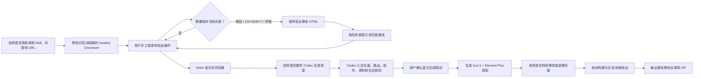

# IT 系统 HTML 基线到交互原型工作流 PRD

## 1. 文档信息

| 项目 | 内容 |
| --- | --- |
| 产品名称 | HTML Baseline to Interactive Prototype Workflow |
| 文档版本 | v3.0 |
| 文档状态 | v3 已实施并通过自动化验收 |
| 更新日期 | 2026-08-13 |
| 目标用户 | IT 网页系统业务分析师 |
| MVP 组件库 | Element Plus |
| 历史需求 | [v2 捕获工具 PRD](./archive/PRD-v2-rendered-dom-capture.md) |
| 实施与验收 | [v3 Step 17–35](./plans/v3/README.md)（全部完成） |

## 2. 背景

业务分析师需要基于已经上线的 IT 系统制作可交互高保真原型，并持续与业务用户核对新需求。原系统通常是 Vue 3 SPA，但业务分析师未必能读取其源码；服务器返回的初始 HTML 也不能反映前端渲染后的表格、表单、弹窗、路由和业务语料。

现有仓库已经能够用 Playwright 打开有界面 Chromium，由用户手工操作并随时保存当前渲染 DOM。该能力需要升级成完整工作流：

1. 把原系统当前页面保存为只读 HTML 基线。
2. 由 Codex 直接阅读全部 HTML 基线和自然语言说明，创建独立的 Vue 3 + Element Plus 交互原型。
3. 业务分析师通过自然语言持续新增或修改功能。
4. 自动验证工程、关键交互和页面布局。
5. 输出完全离线的静态网站 ZIP，用户解压后双击 `index.html` 即可评审。

## 3. 产品原则

1. **基线与原型分离**：捕获 HTML 是原系统事实参考，不直接改造成原型；Vue 工程是可持续修改的交互稿。
2. **只录制 HTML**：不保存截图、视频、Playwright Codegen、操作轨迹或流程模型。
3. **用户决定捕获时机**：不设关键点、步骤、路由或 selector 门禁。
4. **简单覆盖语义**：文件名就是页面名称；同名 capture 直接覆盖旧 HTML。
5. **AI 直接实现**：不开发确定性的 HTML→Vue 转换器、页面分析工具、页面 Agent 或工作台。
6. **组件库优先**：新页面和修改页面必须使用 Element Plus，并尽量继承基线页面风格、语料和数据。
7. **单仓库单系统**：一个 Git 仓库对应一个 IT 系统；不建设跨项目管理能力。
8. **用户负责内容治理**：工具不做脱敏、隐私扫描、Git 提交门禁或资源版权判断。

## 4. 目标与非目标

### 4.1 产品目标

- 用自然语言调用独立录制 Skill，并提供本次目标 URL。
- 在隔离的有界面 Chromium 中由用户手工登录和操作。
- 在任意时刻保存当前渲染 DOM，形成多页面最新 HTML 基线。
- 使用页面标题或显式名称确定文件名；同名覆盖。
- Codex 直接依据全部基线生成完整、多页面、可交互的 Vue 3 原型。
- 原型尽量保留原系统菜单、路由、面包屑、页面层级、数据和业务文案。
- 自然语言需求可修改已有页面，也可新增页面、菜单、路由和交互。
- 原型具备查询、筛选、分页、表单校验、增删改、弹窗、状态切换及成功/失败反馈。
- 自动完成构建、关键交互、溢出、遮挡和静态离线能力检查。
- 交付 Chrome/Edge 可双击打开的完全离线 ZIP。

### 4.2 非目标

- 不读取或依赖原系统前端源码。
- 不把捕获 HTML 恢复成原 Vue 应用。
- 不保存或重放用户操作流程。
- 不保存基线截图，也不做像素级视觉对比。
- 不开发页面身份自动识别、页面管理 UI、版本中心或页面 Agent。
- 不开发 HTML→Vue 确定性代码生成器。
- 不接入真实后端 API；MVP 使用前端内存模拟数据。
- 不为公司自有组件库预建抽象层；MVP 直接使用 Element Plus，后续另行整体迁移。
- 不自动 Git commit；只有用户明确要求时才提交。

## 5. 端到端工作流



### 5.1 首次生成的确认例外

首次生成前，Codex 必须先展示识别摘要并等待确认；摘要包括：

- HTML 文件名对应的页面清单；
- 识别出的路由、菜单、面包屑和页面关系；
- 计划使用的 Element Plus 组件；
- 复用的数据、字段、文案和业务术语；
- 计划实现的主要交互；
- 需要下载或替代的远程视觉资源；
- 无法从 HTML 确定、需要业务分析师补充的事项。

确认后生成当前基线中的全部页面。后续自然语言修改无需修改前确认，Codex 直接实施并在完成后展示 diff、验收结果和交付包位置。

## 6. 仓库产物与目录契约

建议目录：

```text
repo/
  recorder/                    # Playwright 录制与 HTML 捕获工具
  skills/
    capture-spa-html/          # 唯一独立 Skill：启动和指导录制
    element-plus/              # 固定版本的 Element Plus Skills 子集/镜像
  baseline/
    pages/                     # 最新只读 HTML 基线
      用户管理.html
      订单详情.html
  prototype/                   # Vue 3 + TS + Vite + Element Plus 原型源码
  validation/                  # 自动验证配置与报告
  delivery/                    # dist 与离线 ZIP
  docs/
    PRD.md
    archive/
```

约束：

- `baseline/pages/*.html` 只允许录制 Skill 写入；后续 AI 只读。
- 页面 HTML 文件名直接作为页面名称和默认路由推断依据。
- `prototype/` 是自然语言生成和修改的唯一代码目标。
- `delivery/` 是派生产物，可以重复构建。
- 基线是否进入 Git、其中包含何种业务数据，由用户自行决定。

## 7. HTML 录制 Skill

### FR-REC-01 启动

- 用户以自然语言调用 Skill 并提供目标 URL。
- Skill 自动执行 Node、Playwright/系统 Chrome 和目录写权限预检。
- 使用隔离临时 profile 启动 headed Chromium。
- 用户可在浏览器中手工登录；工具不复用日常 Chrome profile。
- 目标 URL 仅用于本次会话，不写入项目配置。

### FR-REC-02 捕获入口与命名

三个入口调用同一个捕获实现：

- 页面 **Capture HTML** 按钮：使用当前 `document.title`；
- 页面获得焦点时按 `Ctrl+Shift+Y`：使用当前 `document.title`；
- 终端 `capture <名称>`：使用显式名称；省略名称时使用当前标题。

标题或名称转换为安全文件名。相同名称直接原子覆盖，不询问、不保留历史；不同名称形成不同页面基线。

### FR-REC-03 HTML 内容

- 保存 doctype 和深克隆后的 `document.documentElement`。
- 固化 input、textarea、select、checked、details/dialog、contenteditable、当前图片地址和滚动位置。
- 保留 DOM、CSS class、业务数据、页面语料和外部 CSS/图片/字体地址。
- 不下载、不内联页面资源。
- 删除 `script`、内联 `on*`、`javascript:` URL 和 meta refresh，使文件成为静态参考。
- 不保存 cookies、Web Storage、IndexedDB 或浏览器 profile。
- 工具不进行业务数据脱敏、隐私校验或 Git 提交判断。
- 每次 capture 只生成一个 HTML，不生成 JSON、PNG、截图、视频或操作记录。

### FR-REC-04 会话结束

- `finish` 正常关闭并保留所有已完成 capture。
- 用户直接关闭浏览器时，CLI 恢复性结束；已成功写入的基线不得损坏。
- 单次捕获失败不得删除其他页面基线。

## 8. 原型生成与修改

### FR-PROTO-01 技术栈

- Vue 3；
- TypeScript；
- Vite；
- Element Plus；
- Vue Router Hash 模式；
- 不使用 Pinia；状态放在页面模块或轻量 composables；
- 模拟数据仅存在内存中，刷新后恢复初始值。

### FR-PROTO-02 Element Plus Skills

仓库固定所需 Element Plus Skills 版本，生成时按页面需要加载。MVP 至少覆盖：

- quickstart、components overview、theming；
- layout、color、typography、border 等设计规范；
- menu、breadcrumb、button、input、select、form；
- table、pagination、descriptions、tabs；
- dialog、drawer、message、notification、popconfirm；
- date picker、checkbox、radio、switch、upload 等常见业务组件。

来源为 [jiaiyan/element-plus-skills](https://github.com/jiaiyan/element-plus-skills)。该仓库声明包含 77 个组件 Skill、5 个设计规范 Skill 和 6 个基础 Skill；具体纳入内容在实施时锁定 commit，并保留上游 MIT 许可文件。

### FR-PROTO-03 风格、数据和语料

- 组件结构必须优先使用 Element Plus，不能用任意 div 重造已有组件。
- 原系统风格优先于 Element Plus 默认视觉；通过主题变量和局部 CSS 还原色彩、间距、边框、字体和布局。
- 页面数据、字段、枚举值、按钮文案、提示语和业务术语尽量复用基线内容。
- 全新页面自动选择业务和结构最接近的基线页面，继承其导航、布局和术语。
- 可访问且允许复用的远程图片、图标和字体，在生成阶段下载到 `prototype` 本地 assets；无法获取的资源使用 Element Plus 图标或本地占位资源替换。
- 用户负责判断资源是否允许复用。

### FR-PROTO-04 页面和交互

- 首次生成覆盖全部 HTML 基线页面。
- 尽量保持原系统 URL 路由、菜单、面包屑和页面层级。
- 支持导航、查询筛选、分页、表单校验、增删改、弹窗、状态切换、成功和失败反馈。
- 复杂后端规则以确定性的前端模拟实现，不调用真实 API。
- 新需求可同时修改已有页面并新增页面；新增页面必须接入菜单、Hash 路由及必要交互。

### FR-PROTO-05 新基线合并

重新录制不会自动覆盖原型。Codex 应对比最新 HTML 基线与当前原型，列出受影响页面和潜在冲突，经用户确认后再合并，并尽量保留已经确认的新需求改动。

## 9. 自动验证

每次首次生成或自然语言修改后执行：

1. TypeScript 类型检查；
2. production build；
3. Chrome 和 Edge 目标下的关键交互 smoke test；
4. 页面加载失败、控制台错误和未处理异常检查；
5. 录制时固定桌面视口下的横向/纵向异常溢出检查；
6. 主要控件遮挡、不可点击和空白页面检查；
7. Hash 路由直接进入和刷新检查；
8. 断网情况下静态资源完整性检查；
9. `file://` 双击打开验证；
10. ZIP 内容与解压后入口验证。

不自动重放原系统流程，不执行基线截图视觉差异。视觉风格和业务正确性由业务分析师对照原系统人工确认。

验证失败时，Codex 应继续修复至通过，或明确报告无法自动解决的业务歧义。默认不提交 Git；只有用户明确要求才 commit。

## 10. 离线交付

### FR-DEL-01 产物

交付包为多文件静态站点：

```text
prototype-offline.zip
  index.html
  assets/
  ...
```

### FR-DEL-02 运行约束

- 用户解压后直接双击 `index.html`。
- 不要求 Node.js、终端、HTTP 服务或联网。
- 所有运行时 JS、CSS、Element Plus、字体、图标、图片和模拟数据包含在 ZIP 中。
- 使用相对资源路径和 Hash 路由。
- 构建结果不得依赖浏览器在 `file://` 下禁止的 ES Module/CORS 行为；实现阶段必须选定并验证兼容构建策略。
- 支持公司桌面环境最新版 Chrome 和 Edge。

## 11. MVP 基准系统选型

### 11.1 候选比较

| 候选 | Vue 3 + Element Plus | 页面/功能覆盖 | 本地数据与登录 | 维护与许可 | 判断 |
| --- | --- | --- | --- | --- | --- |
| [`pure-admin/vue-pure-admin`](https://github.com/pure-admin/vue-pure-admin) | 是 | 表格、Schema 表单、Dialog 表单、账号设置、系统 CRUD 和多层导航 | 仓库内置登录及动态路由 mock，不依赖真实后端；登录 mock 不校验密码 | MIT；`v7.0.0` 发布于 2026-04-07，之后仍有提交 | **推荐**：页面覆盖、本地确定性和维护活跃度最均衡 |
| [`youlaitech/vue3-element-admin`](https://github.com/youlaitech/vue3-element-admin) | 是 | Dashboard、个人中心，以及系统配置、部门、字典、菜单、角色、租户、用户等 CRUD | 可启用开发环境 mock，使用本地演示账号 | MIT；2026-07/08 仍有提交 | 维护活跃，但更偏完整企业权限系统，作为录制基准略重 |
| [`Daymychen/art-design-pro`](https://github.com/Daymychen/art-design-pro) | 是 | Dashboard、表单、数据展示、系统、设置、主题与导航示例 | 前端权限模式可用，但开发 API 默认依赖远程 mock | MIT；`v3.0.2` 发布于 2026-03-15 | 视觉质量较好，但纯本地确定性弱于前两项 |
| [`kailong321200875/vue-element-plus-admin`](https://github.com/kailong321200875/vue-element-plus-admin) | 是 | Dashboard、组件、示例、个人中心、主题、权限和动态菜单 | 内置 Mock Server；公开演示账号 `admin/admin` | MIT；最新正式版 `v2.10.0` 发布于 2025-01-09 | 功能合适，但维护新鲜度弱于前三项 |

### 11.2 选定方案

MVP 录制基准选用 [`pure-admin/vue-pure-admin`](https://github.com/pure-admin/vue-pure-admin)，锁定 [`v7.0.0`](https://github.com/pure-admin/vue-pure-admin/releases/tag/v7.0.0)。官方仓库明确使用 Vue 3、Vite、TypeScript 和 Element Plus；包含 [`mock/`](https://github.com/pure-admin/vue-pure-admin/tree/v7.0.0/mock) 下的登录、动态路由和系统数据，并采用 MIT 许可。该版本要求 Node `^20.19.0 || >=22.13.0`、pnpm `>=9`。

MVP 默认保留其本地 mock 登录；登录只属于基准站自身页面，不进入捕获工具的流程或校验。若实施时需要零点击进入，可只在固定基准副本中预置本地认证状态，不把该改造带入通用录制工具。基准录制至少覆盖：仪表盘/导航、列表与查询、表单、详情、弹窗编辑、设置或主题页面。

## 12. MVP 端到端验收场景

1. 自然语言调用录制 Skill 并传入本地基准系统 URL。
2. 用户在有界面 Chromium 中访问至少 5 个不同页面。
3. 分别使用按钮、快捷键和终端 capture；验证默认标题命名、显式命名和同名覆盖。
4. 验证基线目录只包含最新 HTML：无截图、JSON、视频或轨迹文件。
5. Codex 首次生成前输出完整识别摘要，用户确认后生成所有基线页面。
6. 原型使用 Vue 3、TypeScript、Vite、Element Plus 和 Hash Router，且不使用 Pinia 或真实 API。
7. 向 Codex 提出一条自然语言需求，同时包含：
   - 在已有列表页增加查询条件、表格列或编辑字段；
   - 新增一个相关业务页面，并接入菜单、路由和交互。
8. Codex 直接修改当前原型，完成后展示 diff 和验证结果。
9. 所有自动验证通过，输出完全离线 ZIP。
10. 在断网的 Chrome 和 Edge 中解压并双击 `index.html`，主要页面与交互可用。
11. 业务分析师人工确认页面风格、数据语料与需求表达符合预期。

## 13. 验收指标

| 指标 | MVP 门槛 |
| --- | ---: |
| 任意时刻 capture 成功率 | 20/20 |
| 单次 capture 产物 | 恰好 1 HTML |
| 同名覆盖 | 10/10，无历史副本和半文件 |
| 截图/轨迹/JSON/PNG 产物 | 0 |
| 首次生成页面覆盖率 | 基线页面 100% |
| Element Plus 组件合规率 | 适用组件 100% 使用组件库 |
| 基线字段和业务语料复用 | 人工抽查通过 |
| 必需交互 smoke test | 100% 通过 |
| TypeScript/build/console error | 通过 / 通过 / 0 |
| 固定桌面视口溢出或关键遮挡 | 0 |
| 离线网络请求 | 0 必需运行时请求 |
| Chrome/Edge `file://` 启动 | 2/2 通过 |
| 自然语言修改已有页与新增页 | 两类均验收通过 |

## 14. 风险与处理

| 风险 | 处理 |
| --- | --- |
| HTML 无截图，视觉信息不完整 | 保留 class 和远程资源引用；AI 对照原系统，最终人工确认 |
| 远程资源在生成时不可下载 | 使用 Element Plus 图标或本地占位资源，并在交付说明中列出 |
| 同名页面误覆盖 | 文件名由用户标题或显式名称决定；工具遵循简单、可预期的覆盖语义 |
| 用户捕获敏感业务数据 | 明确由用户自行负责；工具不承诺脱敏或合规检查 |
| 新基线与原型中的新需求冲突 | 先列差异和冲突，经用户确认后合并 |
| `file://` 多文件构建受浏览器限制 | 实施早期制作最小技术探针，同时在 Chrome/Edge 验证 |
| Element Plus Skills 上游变化 | 仓库内固定 commit 和许可，生成时按需加载 |
| 基准系统登录或依赖漂移 | 锁定 commit、依赖锁文件和本地登录跳过补丁 |

## 15. 分阶段实施路线

### 阶段 1：录制能力收敛

- 将现有 Skill 调整为只保存 HTML。
- 改为标题/显式名称命名和同名原子覆盖。
- 删除或停用截图、操作轨迹、页面识别、脱敏和多版本相关设计。
- 支持自然语言 URL 启动、`finish` 与关闭浏览器恢复性结束。

退出条件：三个入口、标题命名、显式命名、同名覆盖及 HTML-only 测试全部通过。

### 阶段 2：基准系统与仓库结构

- 锁定基准系统 commit 和依赖。
- 建立 `baseline/`、`prototype/`、`validation/`、`delivery/` 目录。
- 将 Element Plus Skills 所需子集及许可固定到仓库。
- 完成 5 类页面的本地录制样本。

退出条件：基准系统可重复启动，基线 HTML 齐全，Skill 可从自然语言完成录制。

### 阶段 3：首次交互原型

- 创建 Vue 3 + TypeScript + Vite + Element Plus + Hash Router 工程。
- Codex 直接读取全部基线并生成所有页面。
- 建立内存模拟数据、导航和主要交互。
- 实现主题变量和局部样式以贴近原系统。

退出条件：全部基线页面可访问，主要交互可演示，刷新恢复初始数据。

### 阶段 4：自然语言迭代与验证

- 验收“修改已有页面 + 新增页面”的组合需求。
- 建立 typecheck、build、Chrome/Edge 交互、溢出和控制台检查。
- 新基线进入时支持差异说明、确认和保留已有需求改动。

退出条件：自然语言改动正确落地，自动检查全部通过且不自动 commit。

### 阶段 5：完全离线交付

- 下载或替换原型使用的远程资源。
- 实现相对路径、Hash Router 和 `file://` 兼容打包。
- 生成静态目录与 ZIP，并在断网 Chrome/Edge 双击验收。

退出条件：用户无 Node、无服务、无网络即可打开并完成核心交互。

## 16. MVP 完成定义

完成第 12 节完整闭环；所有第 13 节可自动化指标通过；录制 HTML 始终是只读事实基线，原型源码可持续被自然语言修改，且最终 ZIP 已在 Chrome/Edge 的断网 `file://` 环境验证。按本轮“不需要人工干预”指令，主观风格/业务签收由代理对照审阅替代，真实 OS 双击动作不作虚假声明。
