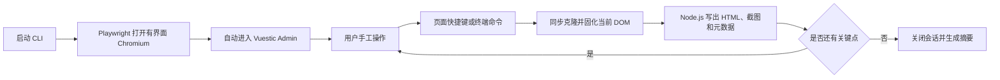

# SPA 关键时点 DOM 快照工具 PRD

## 1. 文档信息

| 项目 | 内容 |
| --- | --- |
| 产品名称 | SPA Keypoint Snapshot（暂定） |
| 文档状态 | Draft v1.0 |
| 更新日期 | 2026-08-12 |
| 基准网站 | Vuestic Admin |
| 首选实现 | Playwright 启动有界面 Chromium，用户手工操作，页面快捷键或终端命令触发快照 |
| 实施计划 | [分步骤实施计划](./plans/README.md) |
| 使用说明 | [USAGE.md](./USAGE.md) |
| 验收矩阵 | [ACCEPTANCE_MATRIX.md](./ACCEPTANCE_MATRIX.md) |

## 2. 背景

在测试、审计、UI 复现和数据采集场景中，需要用户按照既定流程手工操作一个 SPA，并在若干指定关键时点保存浏览器已经渲染完成的 DOM。

传统“查看网页源代码”只能得到服务器返回的初始 HTML，不能得到 Vue 运行后生成的节点、当前表单值、弹窗状态和路由切换后的页面。浏览器“保存网页”又偏向网页归档，难以明确对应某个手工操作时点。

本产品使用 Playwright 启动一个正常可见的 Chromium。用户直接在该浏览器中手工操作；到达关键点后，在页面内按快捷键或在终端输入命令，工具立即冻结当前 DOM，并由 Node.js 进程写出 HTML 文件。该方案不需要开发或安装自定义浏览器插件。

## 3. 产品决策摘要

本期锁定以下决策：

- 使用 Playwright，而不是自研浏览器扩展。
- 由 Playwright 启动独立、有界面的 Chromium，不附着用户日常浏览器。
- 用户操作是真实手工操作，Playwright 只负责浏览器生命周期、关键点捕获和验证。
- 页面快捷键 `Ctrl+Shift+Y` 是默认捕获入口；终端命令是备用入口。
- 主产物是“冻结型 HTML”，用于保存关键时点的 DOM，不承诺重新打开后继续运行原 Vue 应用。
- MVP 的 CSS、图片和字体允许继续引用原网站资源，因此重新打开 HTML 时可能需要联网。
- 同时保存一张参考截图和一份元数据 JSON，用于发现 canvas、Shadow DOM 等 HTML 无法完整表达的差异。

## 4. 目标与非目标

### 4.1 产品目标

1. 用户无需编写自动化脚本即可在可见浏览器中完成手工操作。
2. 在指定关键点快速、稳定地导出当前渲染 DOM 为 HTML。
3. 固化常见运行时状态，包括输入值、勾选状态、选择项、弹窗和当前图片资源。
4. 每个关键点产物可追溯到场景、URL、时间和浏览器视口。
5. 对无法可靠写入 HTML 的内容给出明确告警，不允许静默丢失。
6. 使用自动化验证确认产物未截断、可解析且包含预期状态。

### 4.2 非目标

MVP 不承诺：

- 把 Vue 组件实例、Pinia/Vuex 状态、闭包和事件监听器序列化到 HTML。
- 让保存后的页面在离线状态下继续完整交互。
- 保存 Cookie、Local Storage、IndexedDB、Service Worker 或 WebSocket 会话。
- 捕获虚拟列表中尚未挂载到 DOM 的数据。
- 通用还原 closed Shadow DOM、跨域 iframe、DRM 视频或 WebGL 状态。
- 控制或复用用户日常 Chrome 配置、标签页和登录态。
- 首期支持 Firefox、WebKit 或移动端浏览器。

## 5. 基准网站

### 5.1 选定网站

- 名称：Vuestic Admin
- 入口：https://admin-demo.vuestic.dev/dashboard
- 类型：无需登录即可访问的中型 Vue 3 管理后台 SPA
- 技术栈：Vue 3、Vite、Pinia、Vue Router、Vuestic UI
- 选择原因：包含站内路由、Dashboard、表格、表单、弹窗、主题设置和 canvas 图表，既接近典型业务系统，也能覆盖 DOM 快照的主要边界。

### 5.2 已确认的页面特征

2026-08-11 的初步检查结果：

- Dashboard 可直接访问，无需登录。
- 页面存在 `/users`、`/projects`、`/preferences`、`/settings` 等 SPA 路由。
- Dashboard 渲染后约有 471 个元素、23 个链接和 4 个 canvas。
- 页面完整 `outerHTML` 约为 5.8 万字符，适合作为中型样本的第一阶段基线。

### 5.3 验证关键点

| ID | 页面/状态 | 用户操作 | 快照必须包含 |
| --- | --- | --- | --- |
| K01 | Dashboard 首屏 | 等待统计卡片和图表出现 | 当前路由、主要卡片文本、canvas 告警或替代图像 |
| K02 | Users 列表 | 输入筛选词并完成筛选/排序 | 输入框当前值、列表结果、当前导航状态 |
| K03 | 用户或项目编辑弹窗 | 打开弹窗并填写至少两个字段，不提交 | 弹窗 DOM、表单当前值、遮罩层和打开状态 |
| K04 | Settings/Preferences | 切换主题或布局选项 | 选中状态、主题类名、设置页面内容 |

具体控件 selector 在 PoC 侦察后写入 `scenarios/vuestic.json`。如果线上 Demo 调整了某个弹窗，允许用 Projects 页的等价编辑弹窗替换 K03，但关键点能力要求不变。

## 6. 用户角色与用户故事

### 6.1 目标用户

- 需要保存关键 UI 状态的测试或研发人员。
- 需要收集 SPA 渲染结果的数据工程人员。
- 需要对手工流程进行审计和复现的产品或质量人员。

### 6.2 核心用户故事

- 作为操作人员，我希望启动工具后看到一个普通浏览器窗口，可以像平时一样点击、输入和滚动。
- 作为操作人员，我希望到达关键点时不离开页面，只按一个快捷键就保存当前状态。
- 作为验证人员，我希望知道每个文件对应哪个关键点、何时捕获、来自哪个 URL。
- 作为验证人员，我希望工具明确报告 canvas、iframe 或 Shadow DOM 是否可能缺失。
- 作为安全负责人，我希望密码、文件路径和浏览器存储不会被写入产物。

## 7. 用户流程



标准流程：

1. 用户运行启动命令并选择 Vuestic 场景。
2. 工具启动有界面的 Chromium，并打开场景入口。
3. 终端显示当前待采集关键点，例如 `K01 Dashboard 首屏`。
4. 用户在浏览器内手工完成操作。
5. 用户按 `Ctrl+Shift+Y`；工具立即捕获当前页面。
6. 浏览器页面不弹出会影响 DOM 的提示，终端打印保存结果并推进到下一个关键点。
7. 用户也可在终端输入 `capture K03` 主动捕获指定关键点。
8. 用户输入 `finish` 后，工具关闭浏览器并生成本次运行摘要。

## 8. 功能需求

### FR-01 有界面浏览器

- 使用 `chromium.launchPersistentContext()` 或等价 Playwright API。
- `headless` 必须为 `false`。
- 默认使用隔离的临时或项目级浏览器 profile。
- MVP 限制为单窗口、单业务标签页；若页面打开新标签，终端必须提示用户选择或返回主标签。
- 浏览器关闭时，CLI 应安全退出并保存已完成的运行摘要。

### FR-02 场景配置

场景配置至少包含：

- 场景 ID 和版本。
- 起始 URL。
- 关键点 ID、名称、顺序和可选断言。
- 输出目录。
- 捕获模式：`exact` 或 `settled`。
- 需要忽略或脱敏的 selector。

默认模式为 `exact`。`settled` 模式等待 DOM 连续 300 ms 无变更，最多等待 2 秒，并同时记录用户请求时间与实际捕获时间。

### FR-03 页面快捷键捕获

- 默认快捷键为 `Ctrl+Shift+Y`，允许通过配置修改。
- 使用 Playwright 的 `browserContext.exposeBinding()` 与 `addInitScript()` 建立页面到 Node.js 的捕获通道。
- 快捷键监听脚本不得向业务 DOM 插入按钮、浮层或提示节点。
- 在快捷键事件内先同步克隆并生成 HTML 字符串，再把已经冻结的数据交给 Node.js，避免异步传输期间 SPA 继续变化。
- 快捷键冲突时，应在启动阶段提示用户修改配置。

### FR-04 终端命令捕获

CLI 至少支持：

- `capture`：捕获当前待采关键点。
- `capture <keypoint-id>`：捕获指定关键点。
- `status`：显示 URL、已完成和待完成关键点。
- `skip <keypoint-id>`：跳过关键点并记录原因。
- `finish`：结束运行并生成摘要。
- `quit`：退出；若仍有未保存结果需二次确认。

终端触发通过 `page.evaluate()` 执行同一套捕获函数。该方式允许轻微调度延迟，并作为快捷键不可用时的备用入口。

### FR-05 DOM 冻结与状态固化

捕获函数必须：

1. 保存原文档 doctype。
2. 同步执行 `document.documentElement.cloneNode(true)`。
3. 按相同 DOM 顺序配对原节点和克隆节点。
4. 将下列 property 状态写回克隆体：
   - `input.value`；
   - checkbox/radio 的 `checked`；
   - `textarea.value`；
   - `option.selected`；
   - `details`、`dialog` 等打开状态；
   - 图片的 `currentSrc`；
   - `contenteditable` 当前 DOM 内容。
5. 记录页面和可滚动容器的滚动位置到元数据。
6. 对可读取的 2D canvas 尝试转换为 data URL 图片；失败时保留 canvas 标签并写入告警。
7. 在 `<head>` 中加入来源、关键点、时间、视口等快照元数据。
8. 插入正确的 `<base href>` 或将关键资源 URL 绝对化。
9. 移除原站点脚本、`on*` 内联事件、`javascript:` URL 和 `meta refresh`。
10. 删除捕获工具自身可能产生的属性或标记。

### FR-06 隐私与安全

- `input[type=password]` 的值必须清空并标记已脱敏。
- `input[type=file]` 的值和本地文件路径不得写入产物。
- 不读取或导出 Cookie、Local Storage、Session Storage、IndexedDB。
- 来源 URL 默认移除 fragment；包含疑似 token、code、key 等查询参数时进行脱敏。
- 冻结 HTML 默认禁用脚本执行，防止本地打开时原 SPA 重新启动或发起写操作。

### FR-07 产物

每个关键点至少生成：

```text
artifacts/<run-id>/
  K01_dashboard.html
  K01_dashboard.png
  K01_dashboard.json
  K02_users-filtered.html
  ...
  run-summary.json
```

HTML 是主交付物；PNG 是捕获瞬间的视觉真值；JSON 至少包含：

- `runId`、`scenarioId`、`scenarioVersion`；
- `keypointId`、`keypointName`；
- `requestedAt`、`capturedAt`、`savedAt`；
- 原始 URL 和脱敏后的 URL；
- viewport、DPR、scroll 位置；
- DOM 节点数、HTML 字节数；
- canvas、iframe、Shadow DOM 和资源告警；
- HTML 与截图文件的 SHA-256。

文件名冲突不得覆盖旧文件，应追加递增序号或唯一时间戳。

### FR-08 状态反馈与错误处理

- 每次捕获成功后，终端打印关键点、URL、文件路径、大小和耗时。
- 页面导航中、页面已关闭或序列化失败时，不得生成半文件。
- 单次失败不应关闭浏览器，用户可以重试。
- 检测到跨域 iframe、closed/unavailable Shadow DOM、tainted canvas 时，结果标记为 `completed_with_warnings`。
- 超过 150,000 个 DOM 节点或 25 MB 原始 HTML 时标记 `oversized`，MVP 可中止并提示后续使用分块策略。

## 9. 技术方案

### 9.1 技术栈

- Node.js 20 或更高版本。
- TypeScript。
- Playwright 与 Playwright Test。
- Node.js `readline` 实现交互式终端，避免引入不必要的 CLI 框架。
- Node.js `fs/promises` 与 `crypto` 负责落盘和摘要。

### 9.2 模块划分

| 模块 | 职责 |
| --- | --- |
| CLI Runner | 解析参数、显示关键点、接收终端命令、管理运行状态 |
| Browser Session | 启动/关闭 Chromium，维护当前业务页面 |
| Capture Bridge | 注入快捷键监听和页面到 Node.js 的 binding |
| DOM Serializer | 同步克隆 DOM、固化 property、清理脚本、生成 HTML |
| Artifact Writer | 原子写入 HTML/PNG/JSON，生成 hash 和唯一文件名 |
| Validator | 重开 HTML，执行 DOM、状态、脚本和截图检查 |
| Scenario Provider | 加载 Vuestic 场景和关键点断言 |

### 9.3 捕获时序

页面快捷键模式：

1. `keydown` 事件到达页面注入脚本，记录 `requestedAt`。
2. 页面同步克隆并固化 DOM，记录 `capturedAt`。
3. 调用 Playwright binding，将冻结后的 HTML 和元数据传给 Node.js。
4. Node.js 截取当前页面截图。
5. Artifact Writer 先写临时文件，完成后原子重命名。
6. CLI 输出结果并推进关键点。

终端模式在第 1 步后通过 `page.evaluate()`调用同一序列化函数，其余流程一致。

### 9.4 为什么不使用浏览器扩展或 CDP 附着日常 Chrome

- 本方案已经能通过 Playwright 注入快捷键和读取完整 DOM，无需维护扩展 manifest、权限和安装流程。
- Vuestic Admin 不需要登录，因此没有复用用户日常 profile 的必要。
- 直接附着日常 Chrome 需要远程调试端口和独立 user-data-dir，环境配置更复杂，也扩大了误读私人标签页和登录状态的风险。
- Playwright 自己启动浏览器更容易固定版本、视口和测试环境。

## 10. 产物语义

### 10.1 HTML 的定义

HTML 表示用户触发关键点时已经挂载到 DOM 的静态状态，包括文本、属性和经过补写的表单状态。

它不是：

- 原始服务器响应；
- Vue 应用内存快照；
- 可继续运行的完整 SPA；
- 像素级网页录像；
- 默认离线网页包。

### 10.2 联网要求

MVP 允许 HTML 通过绝对 URL 加载原网站 CSS、图片和字体。因此：

- 联网重新打开时，应尽可能保持原有静态外观。
- 断网时只保证 HTML 结构和内联内容存在，不保证完整样式和图片。
- “单 HTML 完全离线”作为二期资源内联能力评估，不阻塞 MVP。

## 11. 自动验证方案

### 11.1 验证流程

1. 捕获瞬间保存参考截图和 ground-truth JSON。
2. 使用新的 Playwright page 打开生成的 HTML。
3. 断言 HTML 可解析、doctype 存在且没有截断。
4. 对场景配置中的 selector 比较文本、属性和表单状态。
5. 断言冻结 HTML 中不存在可执行的站点脚本和内联事件。
6. 在联网模式下截图并与参考截图比较；动态时间、动画和 canvas 区域允许 mask。
7. 扫描产物，确认测试密码、文件路径和伪造 token 未泄漏。
8. 每个关键点重复采集，汇总成功率和耗时。

### 11.2 验收指标

| 指标 | MVP 门槛 |
| --- | ---: |
| 四个关键点功能通过率 | 每个关键点 20/20 次 |
| 长期捕获成功率目标 | ≥ 99% |
| 快捷键到同步克隆开始 p95 | ≤ 200 ms |
| 50,000 节点以内 DOM 序列化 p95 | ≤ 1 s |
| 单个关键点全部产物保存 p95 | ≤ 3 s |
| 指定文本、属性和表单状态一致率 | 100% |
| HTML 解析成功率 | 100% |
| 产物被截断 | 0 |
| 冻结 HTML 中站点可执行脚本 | 0 |
| password/file 测试值泄漏 | 0 |
| 文件覆盖或关键点串台 | 0 |
| 联网回放视觉差异 | 动态区 mask 后差异像素 ≤ 5% |

## 12. 风险与处理

| 风险 | 影响 | 处理方式 |
| --- | --- | --- |
| 页面在触发后继续变化 | 捕获内容偏离关键时点 | 快捷键脚本先同步克隆，再异步传输 |
| 工具栏或终端切焦导致弹窗关闭 | 丢失瞬时 UI | 默认在页面内使用快捷键，不点击浏览器工具栏 |
| 表单值只存在于 property | `outerHTML` 中值缺失 | 序列化前显式写回克隆节点 |
| canvas/WebGL 不属于 DOM | HTML 重新打开时画面空白 | 可读 canvas 转图片；否则保存截图并告警 |
| Shadow DOM 不在 `outerHTML` | 组件内容缺失 | 检测 open shadow root；MVP 告警，二期评估声明式 Shadow DOM |
| 跨域 iframe 受同源策略限制 | iframe 内部 DOM 不可读 | 保留 iframe 标签、保存截图并告警 |
| 站点 CSS/图片变化或失效 | 历史 HTML 外观变化 | MVP 接受；二期评估资源内联 |
| 原脚本重新运行 | 覆盖快照或产生网络副作用 | 删除脚本、事件属性和 refresh |
| 多标签页定位不清 | 捕获错误页面 | MVP 限制单业务标签页；新标签出现时暂停并提示 |
| Vuestic Demo 改版 | selector 失效 | 场景文件版本化；失败时输出候选节点和人工更新提示 |

## 13. 里程碑

### M1：最小可运行链路

- 启动有界面 Chromium。
- 打开 Vuestic Dashboard。
- 终端 `capture K01` 保存 `page.content()` 基线和截图。
- 建立产物目录和运行摘要。

### M2：准确关键点捕获

- 页面快捷键和 Playwright binding。
- 自定义 DOM Serializer。
- 表单状态固化、脚本清理、隐私脱敏。
- 完成 K01–K04 场景。

### M3：自动验证

- 重开 HTML 并校验 selector。
- 截图对比和动态区 mask。
- 20 次重复捕获与性能报告。

### M4：可选增强

- 资源内联与离线单 HTML。
- open Shadow DOM 和同源 iframe 深度捕获。
- 多标签页选择。
- 更多 Vue SPA 场景。

## 14. MVP 完成定义

满足以下条件即认为 MVP 完成：

1. 一个命令可启动有界面 Chromium 并打开 Vuestic Admin。
2. 用户可以全程手工操作页面。
3. 页面快捷键和终端命令均能触发关键点捕获。
4. K01–K04 均生成 HTML、PNG 和 JSON。
5. 表单值、勾选项、弹窗状态和当前路由在 HTML 中正确固化。
6. 产物不包含密码、文件路径或可执行的原站点脚本。
7. 自动验证满足第 11.2 节门槛。
8. 所有不可完整序列化的内容均在元数据和终端中有明确告警。
